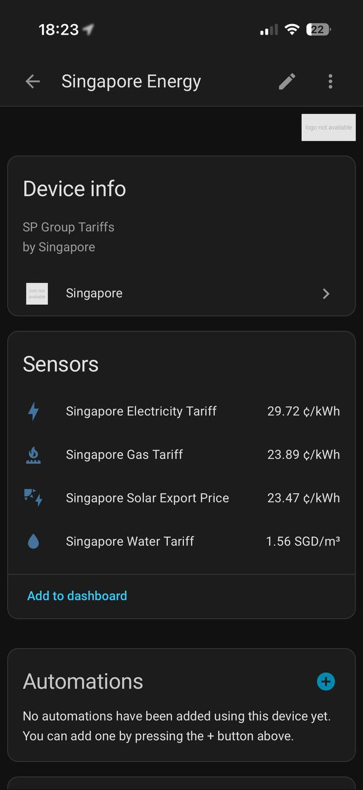
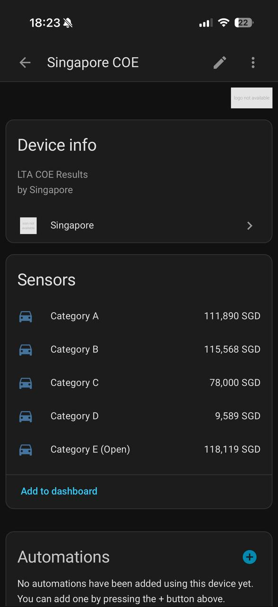
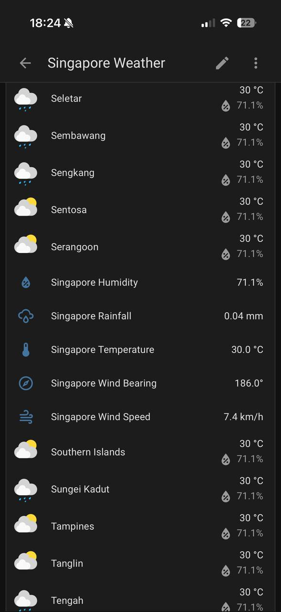
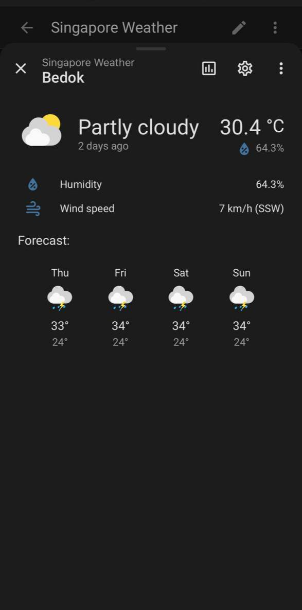
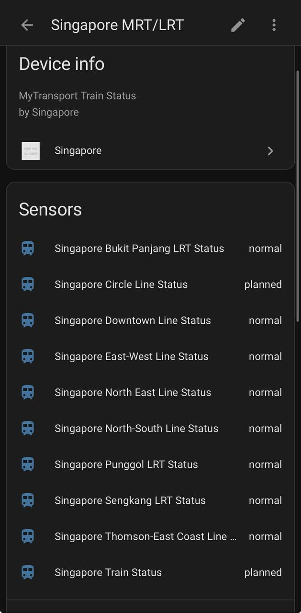
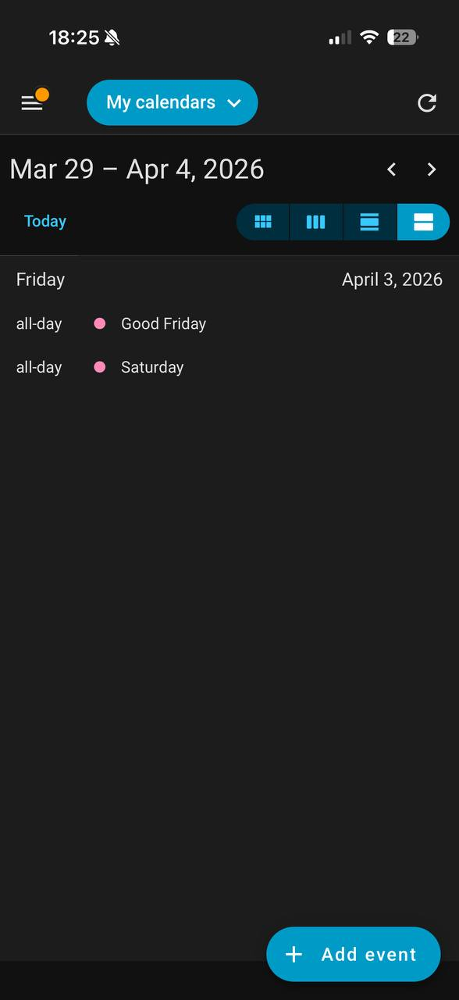

<p align="center">
  
</p>

# Singapore Home Assistant custom integration

A [HACS](https://hacs.xyz) custom integration that brings your **SP Services household electricity and water usage** directly into Home Assistant — plus utility tariffs, COE results, live weather, train status, and public holidays.

### HACS installation (manual, pre-merge)

This integration is **not merged into the default HACS store yet**, so install it as a
custom repository first:

1. Open **HACS** in Home Assistant.
2. Go to **Integrations**.
3. Open the three-dot menu (top-right) → **Custom repositories**.
4. Repository: `https://github.com/kianhean/singapore-homeassistant`
5. Category: **Integration**
6. Click **Add**.
7. Search for **Singapore** in HACS and install it.
8. Restart Home Assistant.

---

## Headline feature: SP Services household usage

Track your actual electricity and water consumption — not just tariff rates — directly from your SP Services account. Sensors update every hour.

| Entity | Name | Unit | What it shows |
|--------|------|------|---------------|
| `sensor.sp_electricity_today` | SP Electricity Today | kWh | Today's electricity consumption so far |
| `sensor.sp_electricity_this_month` | SP Electricity This Month | kWh | Running total for the current billing month |
| `sensor.sp_water_today` | SP Water Today | m³ | Today's water consumption so far |
| `sensor.sp_water_this_month` | SP Water This Month | m³ | Running total for the current billing month |

The monthly sensors expose a `last_month_kwh` / `last_month_m3` attribute for quick comparison.
All sensors include `account_no`, `source`, and `last_updated` attributes.

### How to connect your SP Services account

The SP Services portal uses Auth0 with SMS MFA, so you need to complete the login in a real browser and hand the resulting token to Home Assistant via a **callback URL**. The integration guides you through this during setup — here is exactly what to expect.

#### Step-by-step: getting the callback URL

1. **Start the integration setup** (Settings → Devices & Services → Add Integration → Singapore). After entering a name, the config flow shows a long login URL beginning with `https://identity.spdigital.auth0.com/authorize?...`.

2. **Open that URL in a browser** — any browser on your phone or computer works. You will land on the SP Digital login page.

3. **Log in** with your SP Services / SP Digital account:
   - Enter your email address and password.
   - Enter the 6-digit SMS OTP sent to your registered mobile number.

4. **After the OTP is accepted**, the browser will redirect to a URL that starts with:
   ```
   https://services.spservices.sg/callback?fromLogin=true&code=...&state=...
   ```
   The page itself may be **blank or show an error** — that is completely normal and expected. The data you need is in the URL, not the page content.

5. **Copy the full URL** from the browser address bar. It will look like:
   ```
   https://services.spservices.sg/callback?fromLogin=true&code=wH4xK2...&state=eyJub25j...
   ```
   Make sure you copy everything — the `code=` and `state=` parameters are what the integration uses to obtain your access token.

6. **Paste the full URL** into the "Callback URL" field in the Home Assistant config flow and click **Submit**.

> **Tip:** The login URL is time-limited. Try to complete steps 2–6 without long interruptions. If it fails, restart the flow to get a fresh URL.

> **Skipping:** Leave the Callback URL field empty and click Submit to skip. All other sensors will still work; you can add SP login later by removing and re-adding the integration.

#### Re-authentication

The SP Services access token expires periodically. When it does, Home Assistant shows a **re-authentication required** notification. Click it and follow the same browser login steps above to get a fresh callback URL.

---

## What else you get

### SP Group utility tariffs

Scraped from the [SP Group tariff page](https://www.spgroup.com.sg/our-services/utilities/tariff-information)
every 24 hours.

| Entity ID | Name | Unit | Description |
|-----------|------|------|-------------|
| `sensor.singapore_electricity_tariff` | Singapore Electricity Tariff | ¢/kWh | Total residential electricity tariff |
| `sensor.singapore_solar_export_price` | Singapore Solar Export Price | ¢/kWh | Electricity tariff minus network costs |
| `sensor.singapore_gas_tariff` | Singapore Gas Tariff | ¢/kWh | Piped natural gas tariff |
| `sensor.singapore_water_tariff` | Singapore Water Tariff | SGD/m³ | Water tariff, lower residential tier (≤40 m³, with GST) |

Tariff sensors include `quarter` (e.g. `Q1`), `year`, and `source` as state attributes.
The solar export price sensor also includes `network_cost` and `total_tariff`.

<p align="center">
  
</p>

### COE bidding results

Pulled from the [LTA dataset on data.gov.sg](https://data.gov.sg/datasets/d_69b3380ad7e51aff3a7dcc84eba52b8a/view)
daily at **19:30**, after each bidding exercise.

| Entity ID | Name | Unit | Category |
|-----------|------|------|----------|
| `sensor.singapore_coe_category_a` | Singapore COE Category A | SGD | Cars ≤1600cc / ≤97kW (electric) |
| `sensor.singapore_coe_category_b` | Singapore COE Category B | SGD | Cars >1600cc / >97kW (electric) |
| `sensor.singapore_coe_category_c` | Singapore COE Category C | SGD | Goods vehicles and buses |
| `sensor.singapore_coe_category_d` | Singapore COE Category D | SGD | Motorcycles |
| `sensor.singapore_coe_category_e` | Singapore COE Category E (Open) | SGD | Open — all except motorcycles |

Each sensor includes `category`, `description`, `month`, `bidding_no`, and `source` as
state attributes.

<p align="center">
  
</p>

### NEA realtime weather readings

Updated every **10 minutes** from [data.gov.sg collection 1459](https://data.gov.sg/collections/1459/view).
Station readings are averaged across all available stations at fetch time.

| Entity ID | Name | Unit | Description |
|-----------|------|------|-------------|
| `sensor.singapore_temperature` | Singapore Temperature | °C | Aggregated air temperature |
| `sensor.singapore_humidity` | Singapore Humidity | % | Aggregated relative humidity |
| `sensor.singapore_wind_speed` | Singapore Wind Speed | km/h | Aggregated wind speed |
| `sensor.singapore_wind_bearing` | Singapore Wind Bearing | ° | Aggregated wind direction |
| `sensor.singapore_rainfall` | Singapore Rainfall | mm | Aggregated rainfall |

<p align="center">
  
</p>

### Weather entities (2-hour forecast, by area)

One weather entity per forecast area from [data.gov.sg collection 1456](https://data.gov.sg/collections/1456/view),
updated every **10 minutes**. Each 2-hour NEA forecast block becomes two hourly forecast
points in Home Assistant.

Example entities: `weather.singapore_weather_bedok`, `weather.singapore_weather_ang_mo_kio`,
`weather.singapore_weather_woodlands`.

Each entity has a mapped HA condition (`sunny`, `partlycloudy`, `rainy`, etc.), an hourly
forecast list, and attributes like `raw_condition`, `valid_start`, and `valid_end`.

<p align="center">
  
</p>

### MRT/LRT train status

Updated every **5 minutes** from [mytransport.sg](https://www.mytransport.sg/trainstatus).
Tracks both an overall network status and a per-line status for each MRT/LRT line.

| Entity ID | Name | Description |
|-----------|------|-------------|
| `sensor.singapore_train_status` | Singapore Train Status | Overall network status: `normal`, `planned`, or `disruption` |
| `sensor.singapore_<line>_status` | e.g. Singapore Circle Line Status | Per-line status |

Lines: North-South, East-West, North East, Circle, Downtown, Thomson-East Coast,
Bukit Panjang LRT, Sengkang LRT, Punggol LRT.

<p align="center">
  
</p>

### Public holidays

Updated every 24 hours from [MOM](https://www.mom.gov.sg/employment-practices/public-holidays).
Shows up as a Home Assistant calendar with all-day events from the current year onward.

| Entity ID | Name |
|-----------|------|
| `calendar.singapore_public_holidays` | Singapore Public Holidays |

<p align="center">
  
</p>

## Example sensor states

```yaml
sensor.sp_electricity_today:
  state: 4.2
  unit_of_measurement: kWh
  attributes:
    account_no: "1234567890"
    source: SP Services
    last_updated: "2026-04-12T10:00:00"

sensor.sp_electricity_this_month:
  state: 187.5
  unit_of_measurement: kWh
  attributes:
    last_month_kwh: 312.1
    account_no: "1234567890"
    source: SP Services

sensor.singapore_electricity_tariff:
  state: 29.72
  unit_of_measurement: ¢/kWh
  attributes:
    quarter: Q2
    year: 2026
    source: SP Group

sensor.singapore_coe_category_a:
  state: 95501
  unit_of_measurement: SGD
  attributes:
    category: Category A
    description: Cars up to 1600cc / 97kW (electric)
    month: "2026-03"
    bidding_no: 1
    source: data.gov.sg / LTA
```

## Setup

1. Go to **Settings → Devices & Services → Add Integration**.
2. Search for **Singapore**.
3. Enter a name and click **Submit**.
4. On the next screen, follow the [SP Services browser login steps](#step-by-step-getting-the-callback-url) to enable usage sensors — or leave the field empty to skip.

All public sensors (tariffs, COE, weather, train status, holidays) start working immediately regardless of whether you complete the SP login.

## Data sources

| Source | Data | Refresh |
|--------|------|---------|
| [SP Services](https://services.spservices.sg) | Household electricity & water usage (requires login) | Every 1 h |
| [SP Group](https://www.spgroup.com.sg/our-services/utilities/tariff-information) | Electricity, gas, water tariffs | Every 24 h |
| [data.gov.sg / LTA](https://data.gov.sg/datasets/d_69b3380ad7e51aff3a7dcc84eba52b8a/view) | COE bidding results | Daily at 19:30 |
| [data.gov.sg / NEA (collection 1456)](https://data.gov.sg/collections/1456/view) | 2-hour area weather forecasts | Every 10 min |
| [data.gov.sg / NEA (collection 1459)](https://data.gov.sg/collections/1459/view) | Realtime weather readings | Every 10 min |
| [MOM](https://www.mom.gov.sg/employment-practices/public-holidays) | Public holidays | Every 24 h |
| [mytransport.sg](https://www.mytransport.sg/trainstatus) | MRT/LRT train status | Every 5 min |

## Development

See [CLAUDE.md](CLAUDE.md) for project structure, test instructions, and conventions.

```bash
pip install -r requirements_test.txt
pytest tests/ -v
```

## License

This project is licensed under the [MIT License](LICENSE).
