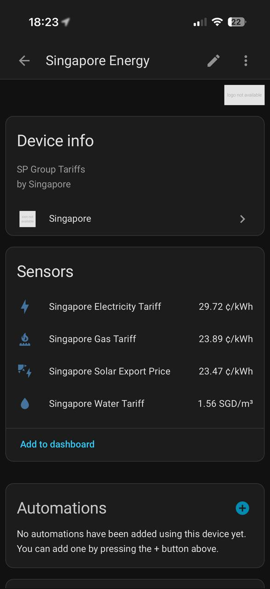
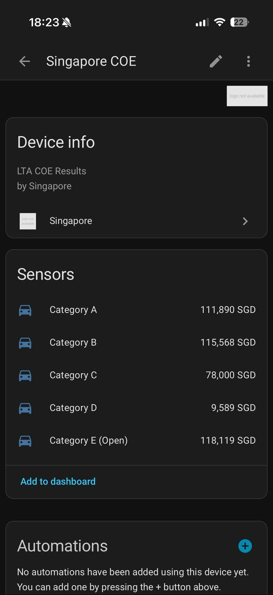
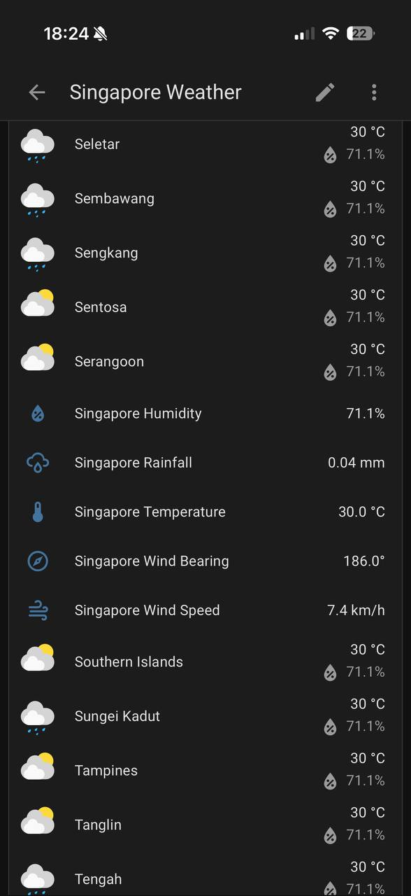
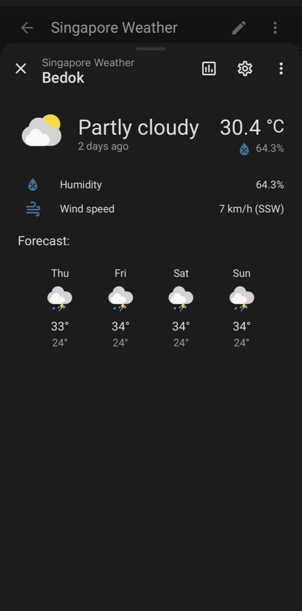
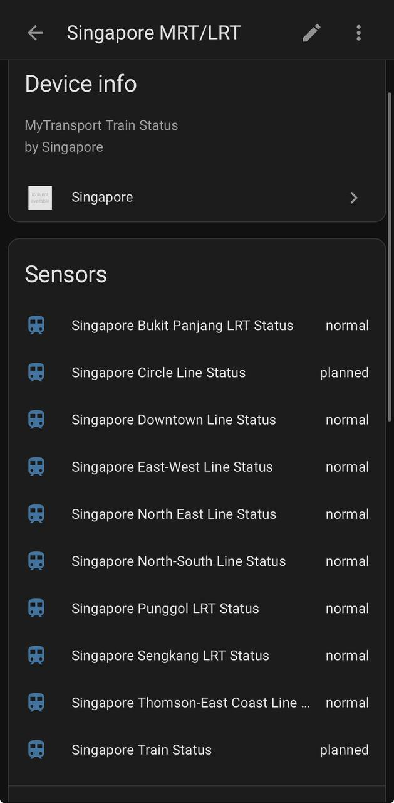
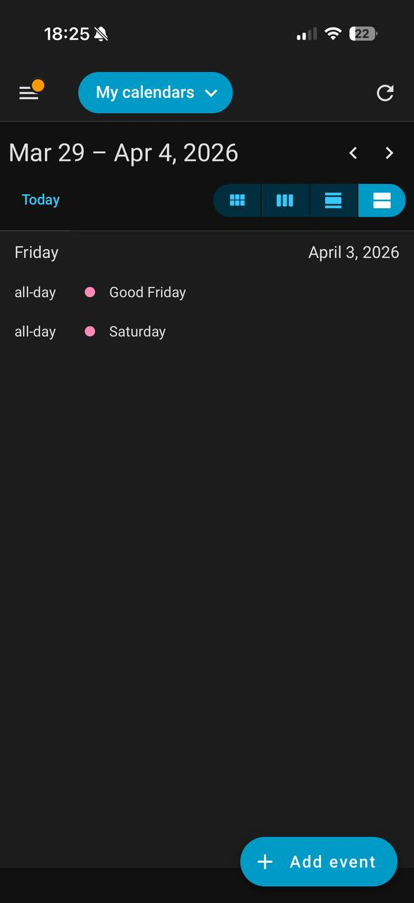

<p align="center">
  
</p>

# Singapore Home Assistant custom integration

A [HACS](https://hacs.xyz) custom integration for Singapore-specific data: utility
tariffs, COE bidding results, live weather, train status, and public holidays.

### HACS installation (manual, pre-merge)

This integration is **not merged into the default HACS store yet**, so install it as a
custom repository first:

1. Open **HACS** in Home Assistant.
2. Go to **Integrations**.
3. Open the three-dot menu (top-right) → **Custom repositories**.
4. Repository: `https://github.com/kianhean/singapore-homeassistant`
5. Category: **Integration**
6. Click **Add**.
7. Search for **Singapore** in HACS and install it.
8. Restart Home Assistant.

## What you get

### SP Group utility tariffs

Scraped from the [SP Group tariff page](https://www.spgroup.com.sg/our-services/utilities/tariff-information)
every 24 hours.

| Entity ID | Name | Unit | Description |
|-----------|------|------|-------------|
| `sensor.singapore_electricity_tariff` | Singapore Electricity Tariff | ¢/kWh | Total residential electricity tariff |
| `sensor.singapore_solar_export_price` | Singapore Solar Export Price | ¢/kWh | Electricity tariff minus network costs |
| `sensor.singapore_gas_tariff` | Singapore Gas Tariff | ¢/kWh | Piped natural gas tariff |
| `sensor.singapore_water_tariff` | Singapore Water Tariff | SGD/m³ | Water tariff, lower residential tier (≤40 m³, with GST) |

Tariff sensors include `quarter` (e.g. `Q1`), `year`, and `source` as state attributes.
The solar export price sensor also includes `network_cost` and `total_tariff`.

<p align="center">
  
</p>

### COE bidding results

Pulled from the [LTA dataset on data.gov.sg](https://data.gov.sg/datasets/d_69b3380ad7e51aff3a7dcc84eba52b8a/view)
daily at **19:30**, after each bidding exercise.

| Entity ID | Name | Unit | Category |
|-----------|------|------|----------|
| `sensor.singapore_coe_category_a` | Singapore COE Category A | SGD | Cars ≤1600cc / ≤97kW (electric) |
| `sensor.singapore_coe_category_b` | Singapore COE Category B | SGD | Cars >1600cc / >97kW (electric) |
| `sensor.singapore_coe_category_c` | Singapore COE Category C | SGD | Goods vehicles and buses |
| `sensor.singapore_coe_category_d` | Singapore COE Category D | SGD | Motorcycles |
| `sensor.singapore_coe_category_e` | Singapore COE Category E (Open) | SGD | Open — all except motorcycles |

Each sensor includes `category`, `description`, `month`, `bidding_no`, and `source` as
state attributes.

<p align="center">
  
</p>

### NEA realtime weather readings

Updated every **10 minutes** from [data.gov.sg collection 1459](https://data.gov.sg/collections/1459/view).
Station readings are averaged across all available stations at fetch time.

| Entity ID | Name | Unit | Description |
|-----------|------|------|-------------|
| `sensor.singapore_temperature` | Singapore Temperature | °C | Aggregated air temperature |
| `sensor.singapore_humidity` | Singapore Humidity | % | Aggregated relative humidity |
| `sensor.singapore_wind_speed` | Singapore Wind Speed | km/h | Aggregated wind speed |
| `sensor.singapore_wind_bearing` | Singapore Wind Bearing | ° | Aggregated wind direction |
| `sensor.singapore_rainfall` | Singapore Rainfall | mm | Aggregated rainfall |

<p align="center">
  
</p>

### Weather entities (2-hour forecast, by area)

One weather entity per forecast area from [data.gov.sg collection 1456](https://data.gov.sg/collections/1456/view),
updated every **10 minutes**. Each 2-hour NEA forecast block becomes two hourly forecast
points in Home Assistant.

Example entities: `weather.singapore_weather_bedok`, `weather.singapore_weather_ang_mo_kio`,
`weather.singapore_weather_woodlands`.

Each entity has a mapped HA condition (`sunny`, `partlycloudy`, `rainy`, etc.), an hourly
forecast list, and attributes like `raw_condition`, `valid_start`, and `valid_end`.

<p align="center">
  
</p>

### MRT/LRT train status

Updated every **5 minutes** from [mytransport.sg](https://www.mytransport.sg/trainstatus).
Tracks both an overall network status and a per-line status for each MRT/LRT line.

| Entity ID | Name | Description |
|-----------|------|-------------|
| `sensor.singapore_train_status` | Singapore Train Status | Overall network status: `normal`, `planned`, or `disruption` |
| `sensor.singapore_<line>_status` | e.g. Singapore Circle Line Status | Per-line status |

Lines: North-South, East-West, North East, Circle, Downtown, Thomson-East Coast,
Bukit Panjang LRT, Sengkang LRT, Punggol LRT.

<p align="center">
  
</p>

### SP Services household usage (optional, requires login)

Your own electricity and water consumption from the
[SP Services portal](https://services.spservices.sg), polled every **30 minutes**.
This is opt-in: it only appears after you link your SP account (see
[Linking your SP Services account](#linking-your-sp-services-account)).

| Entity ID | Name | Unit | Description |
|-----------|------|------|-------------|
| `sensor.singapore_electricity_usage_today` | Singapore Electricity Usage Today | kWh | Electricity used today |
| `sensor.singapore_electricity_usage_this_month` | Singapore Electricity Usage This Month | kWh | Electricity used in the current month |
| `sensor.singapore_electricity_usage_last_month` | Singapore Electricity Usage Last Month | kWh | Last published monthly electricity total |
| `sensor.singapore_water_usage_this_month` | Singapore Water Usage This Month | m³ | Water used in the current month |
| `sensor.singapore_water_usage_last_month` | Singapore Water Usage Last Month | m³ | Last published monthly water total |

SP publishes the in-progress month late, so the "this month" sensors stay
`unknown` (not `0`) until SP publishes them. SP does not publish same-day water
usage in any of its exports, so there is no "water today" sensor.

### Public holidays

Updated every 24 hours from [MOM](https://www.mom.gov.sg/employment-practices/public-holidays).
Shows up as a Home Assistant calendar with all-day events from the current year onward.

| Entity ID | Name |
|-----------|------|
| `calendar.singapore_public_holidays` | Singapore Public Holidays |

<p align="center">
  
</p>

## Example sensor states

```yaml
sensor.singapore_electricity_tariff:
  state: 29.72
  unit_of_measurement: ¢/kWh
  attributes:
    quarter: Q2
    year: 2026
    source: SP Group

sensor.singapore_solar_export_price:
  state: 23.47
  unit_of_measurement: ¢/kWh
  attributes:
    quarter: Q2
    year: 2026
    source: SP Group
    network_cost: 6.25
    total_tariff: 29.72

sensor.singapore_coe_category_a:
  state: 95501
  unit_of_measurement: SGD
  attributes:
    category: Category A
    description: Cars up to 1600cc / 97kW (electric)
    month: "2026-03"
    bidding_no: 1
    source: data.gov.sg / LTA

sensor.singapore_temperature:
  state: 31.2
  unit_of_measurement: °C
  attributes:
    source: data.gov.sg / NEA (collection 1459)

sensor.singapore_electricity_usage_today:
  state: 19.967
  unit_of_measurement: kWh
  attributes:
    account_no: "8949049293"
    last_updated: "2026-04-12T16:42:41+08:00"
    source: SP Services
```

## Installation via HACS (manual custom repository)

1. Open HACS in your Home Assistant instance.
2. Go to **Integrations → Custom repositories** (three-dot menu).
3. Add `https://github.com/kianhean/singapore-homeassistant` with category **Integration**.
4. Search for **Singapore** and install it.
5. Restart Home Assistant.

## Setup

1. Go to **Settings → Devices & Services → Add Integration**.
2. Search for **Singapore**.
3. Enter a name and click **Submit**.

All public data (tariffs, COE, weather, trains, holidays) works with no account.

## Linking your SP Services account

Optional — only needed for your own electricity and water usage sensors.

SP Services logs in through Auth0 with a captcha and an SMS OTP, so the
integration cannot log in for you. Instead it hands you a login link and asks
for the URL your browser lands on afterwards:

1. Tick **Link my SP Services account** while adding the integration, or open
   **Configure** on an existing Singapore entry.
2. Open the link shown in the form and sign in to SP Services (captcha + OTP).
3. When the browser reaches `https://services.spservices.sg/callback?...`, copy
   the **full** URL. It disappears quickly — if you miss it, open the browser's
   developer tools **Network** tab, tick **Preserve log**, redo the login, and
   copy the request URL for `services.spservices.sg/callback`.
4. Paste it back into the form. It must contain both `code=` and `state=`.
5. If several utility accounts are linked to the login, pick the one to track.

Your username and password are never entered into Home Assistant — only the
credentials SP hands back are stored.

### Keeping the session alive

SP's Auth0 tenant does not issue a refresh token for every account. What happens
next depends on which case you are in:

- **With a refresh token** — nothing to do; the integration stays signed in
  indefinitely.
- **Without one** — the access token expires on its own (often within hours), so
  the flow offers an extra step: paste your **Auth0 session cookie** and Home
  Assistant renews the login unattended, exactly the way the SP web portal does.

To copy the cookie: in the browser you just signed in with, open developer tools
(F12) → **Application** (Chrome/Edge) or **Storage** (Firefox) → **Cookies** →
`https://identity.spdigital.auth0.com`, and copy the **Value** of the cookie
named `auth0`. It is `HttpOnly`, so it will not show up in `document.cookie`.

The cookie is stored in Home Assistant alongside the tokens and is refreshed on
every renewal, so the link lasts until SP ends the session itself — typically
weeks — and only then does Home Assistant raise a **reauthentication**
notification.

You can skip the cookie step. Usage sensors still work; you will just be asked
to sign in again whenever the access token expires. To check which case your
account is in, enable debug logging and look for
`SP Services issued no refresh token`:

```yaml
logger:
  logs:
    custom_components.singapore: debug
```

To stop tracking usage, open **Configure** on the entry and choose
**Unlink SP Services account** — the stored token is deleted and the usage
sensors are removed.

## Data sources

| Source | Data | Refresh |
|--------|------|---------|
| [SP Group](https://www.spgroup.com.sg/our-services/utilities/tariff-information) | Electricity, gas, water tariffs | Every 24 h |
| [data.gov.sg / LTA](https://data.gov.sg/datasets/d_69b3380ad7e51aff3a7dcc84eba52b8a/view) | COE bidding results | Daily at 19:30 |
| [data.gov.sg / NEA (collection 1456)](https://data.gov.sg/collections/1456/view) | 2-hour area weather forecasts | Every 10 min |
| [data.gov.sg / NEA (collection 1459)](https://data.gov.sg/collections/1459/view) | Realtime weather readings | Every 10 min |
| [MOM](https://www.mom.gov.sg/employment-practices/public-holidays) | Public holidays | Every 24 h |
| [mytransport.sg](https://www.mytransport.sg/trainstatus) | MRT/LRT train status | Every 5 min |
| [SP Services](https://services.spservices.sg) (private endpoints, login required) | Household electricity and water usage | Every 30 min |

## Development

See [CLAUDE.md](CLAUDE.md) for project structure, test instructions, and conventions.

```bash
pip install -r requirements_test.txt
pytest tests/ -v
```

## License

This project is licensed under the [MIT License](LICENSE).
